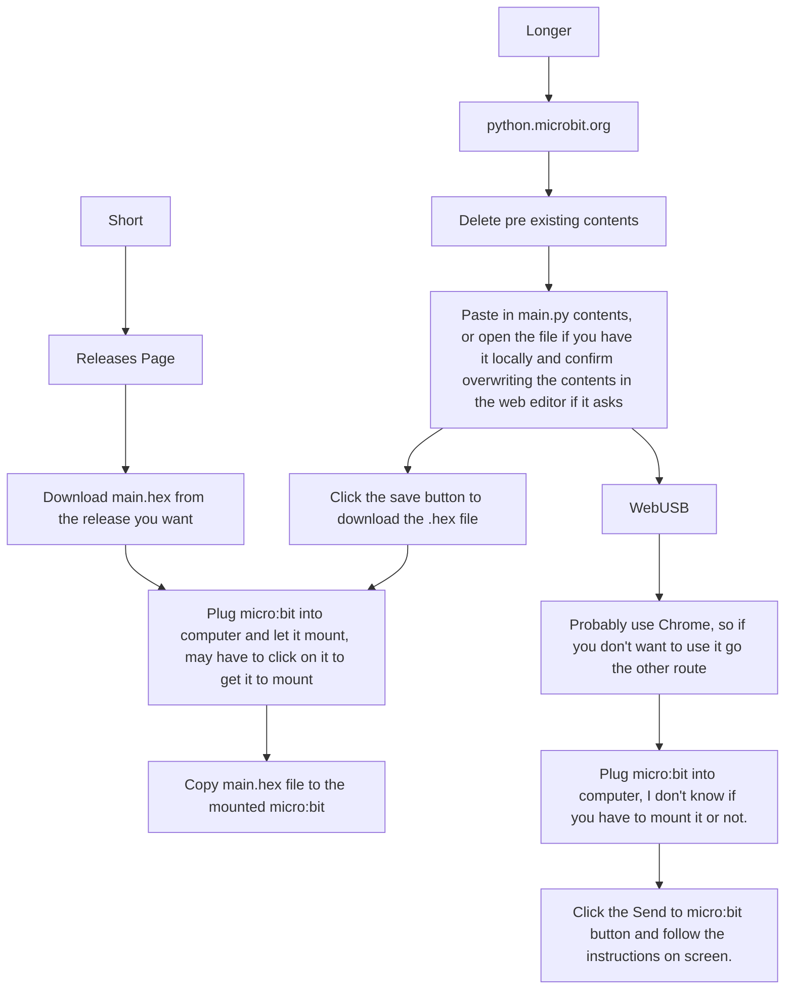

# micro:bit radio security

*Disclaimer*: This may work on v1 micro:bits however I wouldn't know, as I only have a v2.

# How to use
There are two routes that you can go, one is short, the other is slightly longer.

## Short

Head to the releases page and download the main.hex file from whatever release that you want.  Then plug your micro:bit into your computer, wait for it to mount, and then copy the main.hex file to the micro:bit.

## Longer

Open your favorite web browser and head to [python.microbit.org](https://python.microbit.org/v/3).  It should load some default script if you haven't used it before, delete it, then open the main.py file from the repo copy its contents and paste it in.  You could also use the open button if you have the file locally (make sure to confirm replacing the current contents in the web editor if it asks).  Then you have two more options, either flash it via WebUSB (can be easier but is also more finicky), or hit the save button to download it and copy to your micro:bit as stated in the "Short" section.

## WebUSB

This can be easy, however it is also very finicky and I haven't had the best experiences with it working, as such I recommend saving the .hex file instead.  If you really want to do it, though, click on the "Send to micro:bit button" and follow the steps presented on screen.  In my experience this works best in the Chrome browser.

